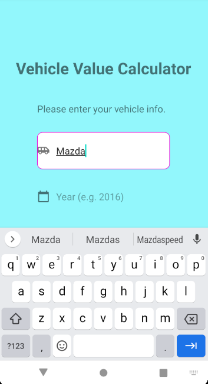
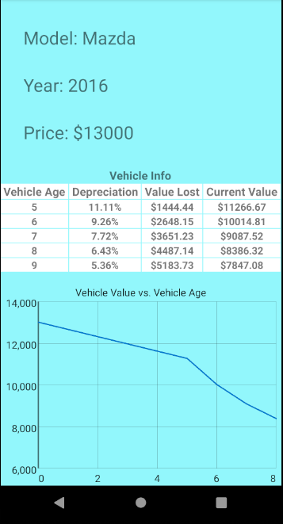

# Hackton_Honda
This is the project accomplished in HackOHI/O 2020 and is for competing in the Honda challenge.

We built a data-driven application using Android Studio that enables individual car owners to maximize the useful value of their mobility investment.

Firstly we wrote a graphic user interface to acquire the vehicle information from the user, and then calculated the vehicle’s value with our algorithm.  We are able to build an interactive graphic user interface to provide the information as a graph to provide an explicit visualization for our user.

Used open source  https://www.themoneycalculator.com/vehicle-finance/calculators/car-depreciation-by-make-and-model/

By utilizing data from the open source, we developed a model of vehicle value based on make, model, and built-year.

